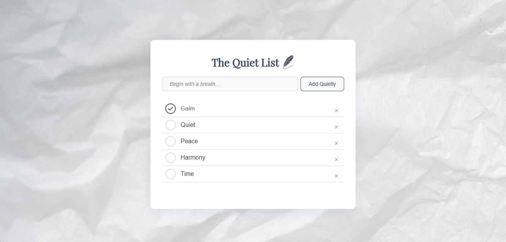

# The Quiet List 🪶

A minimalist to-do app designed for calm, intentional task keeping.  
Built with semantic HTML, elegant CSS, and modular JavaScript every detail crafted with care.

<p align="center">
  
</p>

> A calm interface for mindful task keeping.

---

## ✨ Features

- Add tasks quietly with poetic placeholder guidance
- Check off completed items with subtle visual feedback
- Remove tasks with a gentle tap
- Persistent local storage your list stays even after refresh
- Responsive design for mobile (375px and up)
- Feather icon and textured paper background for a serene aesthetic

## 📐 Tech Stack

- HTML5 + CSS3 (BEM methodology)
- Vanilla JavaScript (modular, event-driven)
- Google Fonts: Playfair Display & Inter
- LocalStorage for data persistence

## 📱 Mobile Optimization

Designed to adapt gracefully on screens as small as 375px.
Input and button stack vertically, font sizes adjust, and spacing remains breathable.

## 🖼️ Design Philosophy

> “A quiet list begins with a thought.”
This app is more than a checklist it’s a space for mindful intention.
Every interaction is soft, every detail considered.

## 🚀 Getting Started

Clone the repository and open `index.html` in your browser:

```bash
git clone https://github.com/ravenmatibag/the-quiet-list.git
